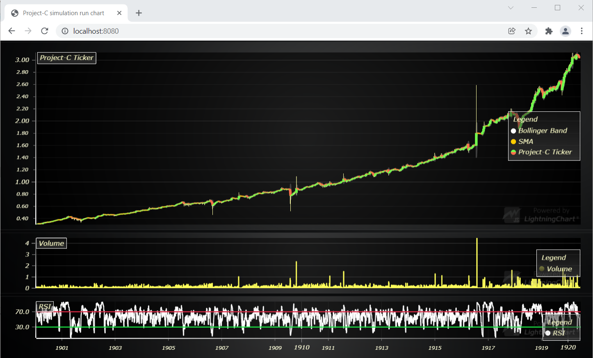
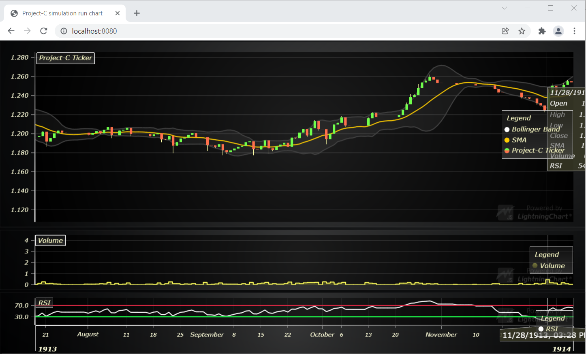
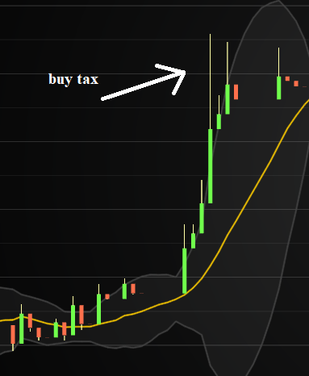

## Description

Loads data from local "my-static-data.json" file to display chart.

- Candle bars
- Simple Moving Average (SMA)
- Bollinger Bands
- Volume
- Relative Strength Index (RSI)

Each green candle is a buy from the LP. The hight represents the volume.
Each red candle is a sell against the LP.
The usual high/low thin line sticking out above or below the candle represents the buy/sell tax. It's an abuse.

## Getting Started

To run application locally with hot reload:

1. Install Node.JS
2. Run `npm install`
3. Run `npm start`
4. Open browser and navigate to http://localhost:8080

Then when "my-static-data.json" is overwritten, application automatically reloads display.

## Credits

This is clone from https://github.com/Arction/lcjs-showcase-trading

